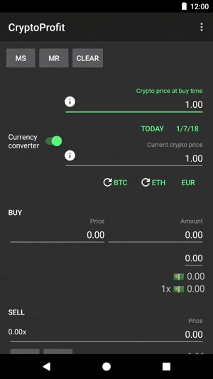
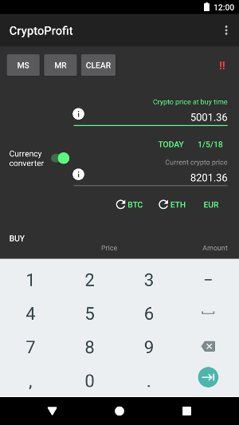
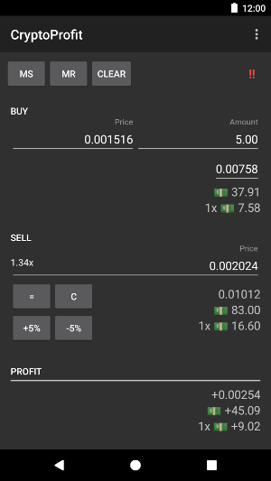

CryptoProfit
=====

This repository contains the source code for the CryptoProfit Android app.

CryptoProfit helps you to calculate a trade's profit or loss.

It uses CryptoCompare API: https://www.cryptocompare.com/api

### Download on Google Play Store

### How to use

### Screenshots
 

### Disclaimer
YOU EXPRESSLY UNDERSTAND AND AGREE THAT YOUR USE OF THE APP (CryptoProfit) IS AT YOUR SOLE RISK AND THAT THE APP (CryptoProfit) IS PROVIDED "AS IS" AND "AS AVAILABLE" WITHOUT WARRANTY OF ANY KIND FROM THE AUTHOR.

Developed by
-------
Héctor de Isidro - hrules6872 

License
-------
    Copyright 2018 Héctor de Isidro - hrules6872

    Licensed under the Apache License, Version 2.0 (the "License");
    you may not use this file except in compliance with the License.
    You may obtain a copy of the License at

       http://www.apache.org/licenses/LICENSE-2.0

    Unless required by applicable law or agreed to in writing, software
    distributed under the License is distributed on an "AS IS" BASIS,
    WITHOUT WARRANTIES OR CONDITIONS OF ANY KIND, either express or implied.
    See the License for the specific language governing permissions and
    limitations under the License.